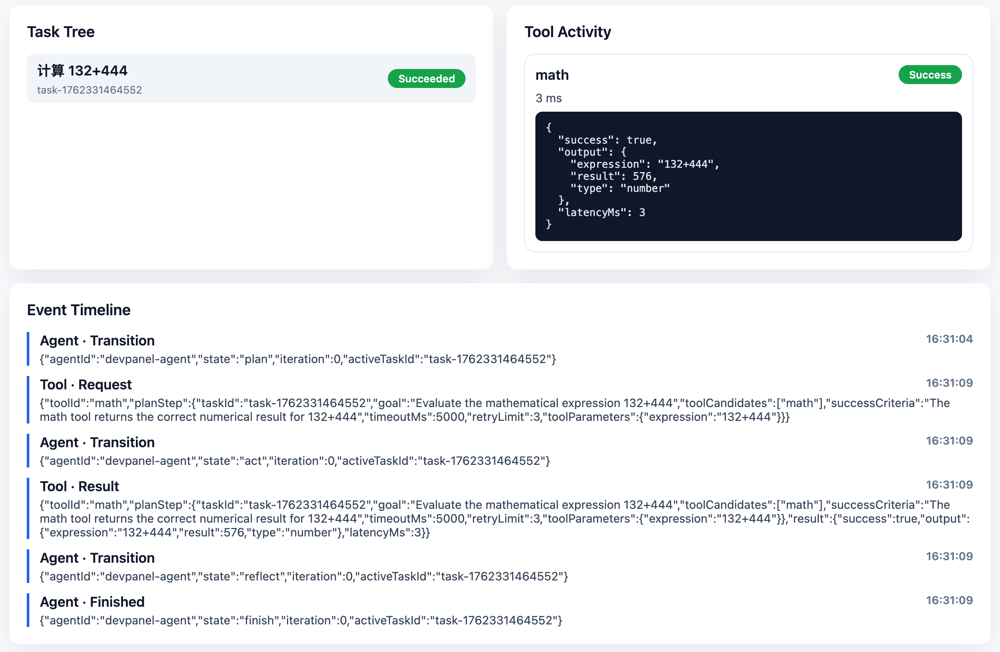

# Agent ReAct FSM Monorepo

基于有限状态机的 ReAct Agent 运行时框架，支持 Plan → Act → Observe → Reflect → Finish 循环，并提供可视化调试面板。



## 快速开始

### 安装依赖

```bash
pnpm install
```

### 启动桥接服务器

```bash
pnpm --filter @agent/runtime dev:bridge
```

服务器将在 `http://localhost:3030` 启动。

如需在开发过程中监听源码变更并自动重启，可使用：

```bash
pnpm --filter @agent/runtime dev:bridge:watch
```

### 启动开发面板

```bash
pnpm --filter @agent/react-devpanel dev
```

打开 `http://localhost:5173`，点击 "Start" 连接服务器，然后可以：

- 查看 Agent 执行状态
- 发送任务并实时监控执行过程
- 查看任务树、工具活动和事件时间线

## 项目结构

```
packages/
├── runtime/      # 运行时核心（Node/TypeScript）
└── devpanel/     # 开发面板（React/Vite）
```

## 文档

详细架构设计请参考 [docs/architecture.md](docs/architecture.md)
